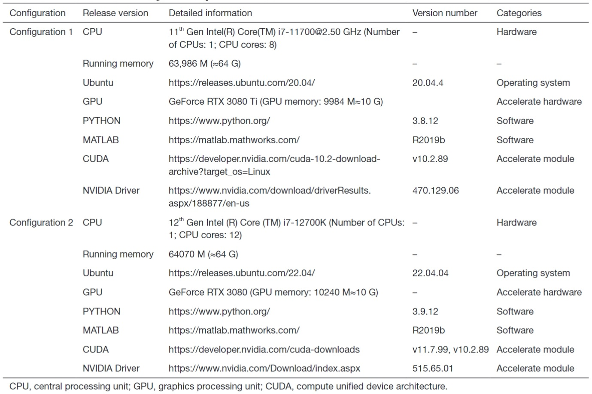

# UFA_toolbox

## Description

The UFA toolbox is a MATLAB toolbox running on the Ubuntu system, which calls the Linux shell scripts and Python scripts to complete the whole analysis pipeline. It was developed by Gaoxing Zheng. We are very grateful to Prof. He Wang for his technical guidance in multi-modal MRI preprocessing and post-processing. We also thank Prof. Xin Wang and Prof. Jing Ding for providing a good hardware and software platform as well as clinical resources. 

The UFA toolbox is designed for multimodal magnetic resonance imaging (MRI) analysis of brain white matter diseases. It enables the automatic extraction of WMHs and establishes an automatic tracking and quantification scheme for superficial U-fibers, helping clinicians combine the T2 FLAIR image and DWI information to understand the white matter lesions with different etiologies. It may help clinicians to identify early white matter damage that is not visible to the naked eye on T2 FLAIR images.

## Requirements

The following table lists the open-source tools that need to be installed in advance to successfully use the UFA toolbox (Table 1). We have detailed instructions on how to successfully install the required open-source tools and how to successfully use the UFA toolbox in the ‘UFA_toolbox_tutorial.pdf’ file.

Table 1 | A list of neuroimaging tools required for successful use of the UFA toolbox.

|  Toolbox   |                      Website                      |   Platform    |                    Usage                    |
| :--------: | :-----------------------------------------------: | :-----------: | :-----------------------------------------: |
|    CNS     |         https://github.com/cheba-nil/CNS          |    Matlab     |               WMH extraction                |
|   SPM12    | https://www.fil.ion.ucl.ac.uk/spm/software/spm12/ |    Matlab     |           Required by CNS toolbox           |
|    FSL     |      https://fsl.fmrib.ox.ac.uk/fsl/fslwiki       |       /       |     Registration module in FSL ‘flirt’      |
|    ANTs    |           http://stnava.github.io/ANTs/           |       /       | N4 bias field correction in ANTs are needed |
| FastSurfer |       https://github.com/Deep-MI/FastSurfer       |    Python     |          T1 cortical segmentation           |
|    WMA     | https://github.com/SlicerDMRI/whitematteranalysis |    Python     |        White matter fiber clustering        |
| 3D Slicer  |              https://www.slicer.org/              | Linux version |            Required by WMA tool             |
| FreeSurfer |        https://surfer.nmr.mgh.harvard.edu/        |       /       |          T1 cortical segmentation           |
|  MRtrix3   |              https://www.mrtrix.org/              | Linux version |              dMRI tractography              |

The recommended computer configurations are listed below (Table 2).

Table 2 | Software and hardware configurations are required for the accelerated calculation.
Abbreviations: HDD -- Hard disk drive.  

## Step-by-Step tutorial

For detailed step-by-step tutorials, please see the "UFA_toolbox_tutorial.pdf" to correctly use our UFA toolbox!
Please cite our paper (https://dx.doi.org/10.21037/qims-23-847) if these codes are helpful in your study!

### UFA toolbox download link

For Chinese users, you can download the UFA toolbox from BaiduNet Disk (link: https://pan.baidu.com/s/1nSwxoQtRrrbeiO3-bQis0w; password: v9uw).
For foreign users, you can download the UFA toolbox from Google Drive ([https://drive.google.com/file/d/15BY76IGg43EemH3sCUQBXAvhCZ1DdrvV/view?usp=sharing](https://drive.google.com/file/d/1JFXeE0vc5q5TJsBL7XT3YjwZCw20P6Xx/view?usp=sharing)).

## Contact

If you have any questions, please send the email to gaoxing.zheng@utsouthwestern.edu.

## Reference

[1]	JIANG J, LIU T, ZHU W, et al. UBO detector–a cluster-based, fully automated pipeline for extracting white matter hyperintensities [J]. Neuroimage, 2018, 174: 539-49.

[2]	ASHBURNER J, BARNES G, CHEN C-C, et al. SPM12 manual [J]. Wellcome Trust Centre for Neuroimaging, London, UK, 2014, 2464(4).

[3]	JENKINSON M, BECKMANN C F, BEHRENS T E, et al. Fsl [J]. Neuroimage, 2012, 62(2): 782-90.

[4]	AVANTS B B, TUSTISON N, SONG G. Advanced normalization tools (ANTS) [J]. Insight j, 2009, 2(365): 1-35.

[5]	HENSCHEL L, CONJETI S, ESTRADA S, et al. Fastsurfer-a fast and accurate deep learning-based neuroimaging pipeline [J]. NeuroImage, 2020, 219: 117012.

[6]	FEDOROV A, BEICHEL R, KALPATHY-CRAMER J, et al. 3D Slicer as an image computing platform for the Quantitative Imaging Network [J]. Magnetic resonance imaging, 2012, 30(9): 1323-41.

[7]	FISCHL B. FreeSurfer [J]. Neuroimage, 2012, 62(2): 774-81.

[8]	TOURNIER J-D, SMITH R, RAFFELT D, et al. MRtrix3: A fast, flexible, and open software framework for medical image processing and visualization [J]. Neuroimage, 2019, 202: 116137.

[9]	HSU C C H, CHONG S T, KUNG Y C, et al. Integrated diffusion image operator (iDIO): A pipeline for automated configuration and processing of diffusion MRI data [R]: Wiley Online Library, 2023.

[10]	SMITH S M, JENKINSON M, WOOLRICH M W, et al. Advances in functional and structural MR image analysis and implementation as FSL [J]. Neuroimage, 2004, 23: S208-S19.

[11]	HENSCHEL L, KüGLER D, REUTER M. FastSurferVINN: Building resolution-independence into deep learning segmentation methods—A solution for HighRes brain MRI [J]. NeuroImage, 2022, 251: 118933.

